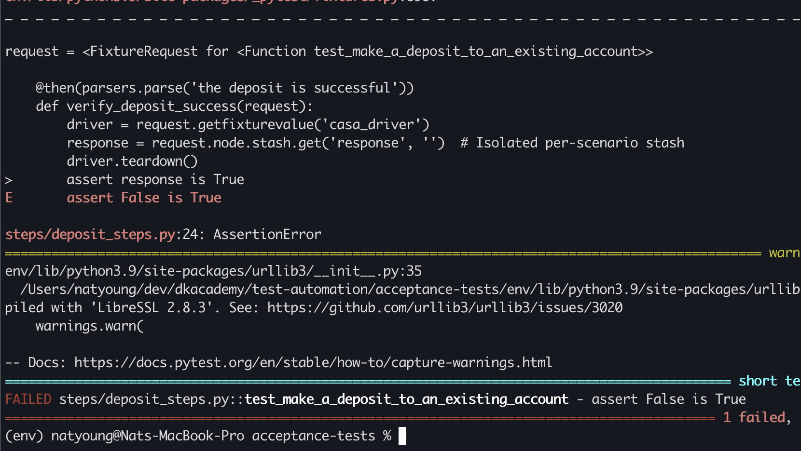
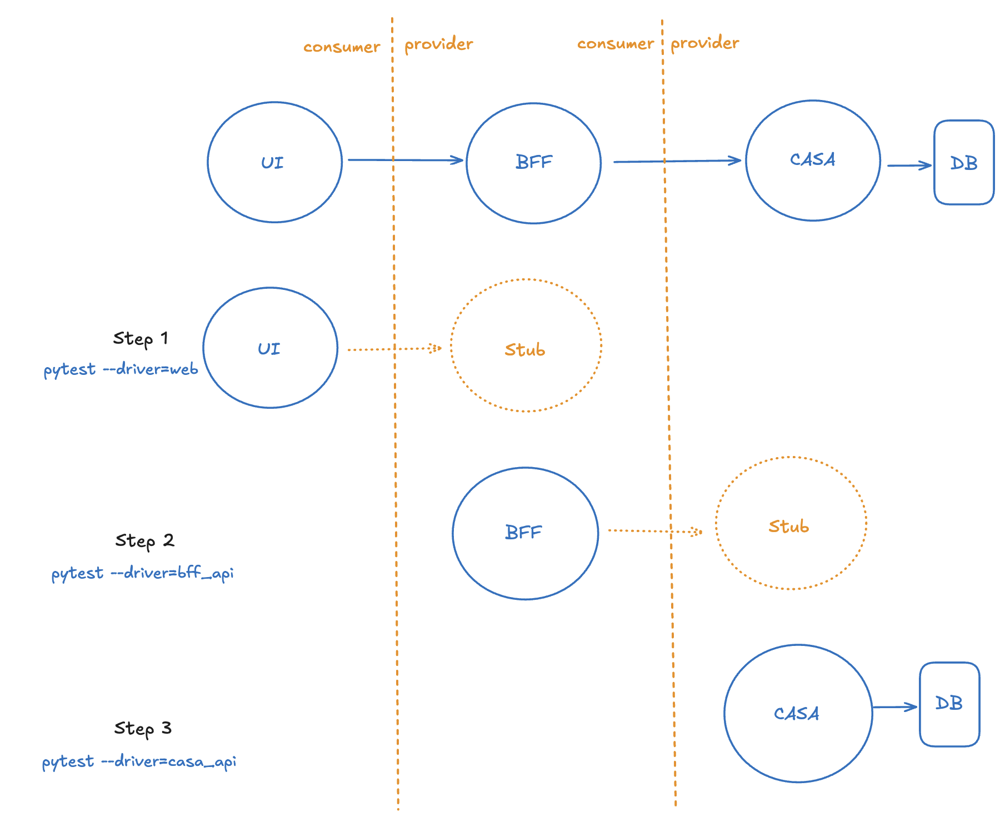

# **Agile testing techniques**

---

# Agenda
1. Acceptance Test Driven Development
2. Contract Driven Development
3. Test Driven Development

___

# Out of scope for today's workshop

- CI
- CD
- Security
- UX
- UI design

--- 

# Encouraged

- Work on one machine
- One person typing
- Rotate the typer frequently (set a timer)
- Commit frequently (with the tests passing)
- Participation

---

# Sample app

A banking app, that has a CASA account.

- Currently, the user can only deposit.
- It's a very small bank with one user. (accountId "1")
- CASA is the only account type.

Problem:
- There's no way for the user to know what their balance is.

---

# User story writing

A _small_, valuable increment to the behaviour of the system from the user's perspective.

Aim for:
- Write from the perspective of the user.
- Focus on _what_ rather than _how_.
- Use a ubiquitous language that's understandable by everyone.

---

# Template

As a _
I want to _
So that _

You can use this template, although you don't have to.
The user story is a placeholder for a conversation.

---

# Domain Specific Language

The language of the problem domain.

Understood by everyone on the team, including stakeholders.

No jargon.

---

# Acceptance Criteria

Write some ACs that describe the behaviour of the system from the perspective of the end-user.

Given _
When  _
Then _

Challenge:
Leave out any implementation details

---

# Executable specifications

Convert one of the ACs into an executable specification.

- Leave out the _how_, this is the developer's concern for later.
- It's not a list of tasks to carry out.
- Pick the simplest one.

- Location: _acceptance_tests/features_

---

# Example 1 (ok)

```gherkin
Feature: Buy a book
    As an Amazon prime member
    I want to find a book by an author
    So that I can buy it

Scenario: Find a book
    Given I am a verified Amazon prime member
    When I search for a book written by an author
    Then I am provided with potential matches
```

The UI could be web, alexa, or in person.

---

# Example 2 (not ok)

```gherkin
Feature: Buy a book
    As an Amazon prime member
    I want to find a book by an author
    So that I can buy it

Scenario: Find a book
    Given I am a verified Amazon prime member
    When I go to amazon.com
    Then I click on the login button
    And I enter my username "Jim Bob"
    And I enter my password "password1"
    And I click on the login button
    Then I am taken to the search page
    Then I click in the bar
    And I type in "Author's Name" in the search bar
    Then I click on the search button
    And I wait for the results
    Then I can see page one of the search results
```

This is brittle to underlying changes in the implementation, and difficult to read.

---

# 4 Layer Test Architecture

1. Test Cases (acceptance-tests/features) _What_
2. DSL (acceptance-tests/steps & features) _What_
3. Drivers (acceptance-tests/drivers) _How_
4. SUT (ui-web, bff-web, casa)

<style scoped>
div {
  font-size: 13px;
}
</style>
<div>
Humble, J. and Farley, D., 2010. Continuous Delivery: Reliable Software Releases through Automation. Addison-Wesley Professional.
</div>

---

# DSL

You don't have to use Gherkin.

You can use any programming language to build up a reusable internal DSL that is then called by the test cases.

- Location: steps (and features)
- Create a _dsl_ folder if you are creating an internal DSL instead of using Gherkin.

---

# Drivers

This is where the technical details go.

- Location: _drivers_

We have web and API drivers. Create more if necessary.

---

# Create a failing acceptance test

- Follow step 1 in the README



---

# TDD

- We are already doing TDD.
- Unit tests give us more precision and faster feedback.

---


# Consumer Driven Contract Testing

- Consumer and Provider
- Avoids E2E integration testing
- Contract Stubs
- Temporally decoupled API development

---
# Test strategy

- Blue: SUT
- Orange: Contract stub



---

# Create a consumer contract

Follow step 2 in the README

---

# Run the provider verification

Follow step 3 in the README

---


# Repeat for the next service

Follow step 4 in the README

---

# Do you see a pattern?

We avoid E2E tests by measuring at the points of interest.

- The test pyramid is not very useful anymore.
- Other models, like the Swiss cheese model are more relevant.

[Swiss cheese model](https://blog.korny.info/2020/01/20/the-swiss-cheese-model-and-acceptance-tests.html)

---

# Manual Testing

Still useful.

- Not used for regression testing. (That's already done if we use the techniques above).
- Exploratory testing.
- Subjective assessment.
- How is the UX?
- Does the app make sense?

---

# Pact Broker

Publish to the broker instead of using the filesystem.

Refer to the sample code file.

---

# CI pipeline

Now we test "inside-out":

Fast tests -> Deployment (prod-like) -> Acceptance Tests

---

# Test project folder structure

In a real world project, put the tests in their respective repos, keep them alongside the code they test.

---

# Who owns the tests?

- Who breaks them?
